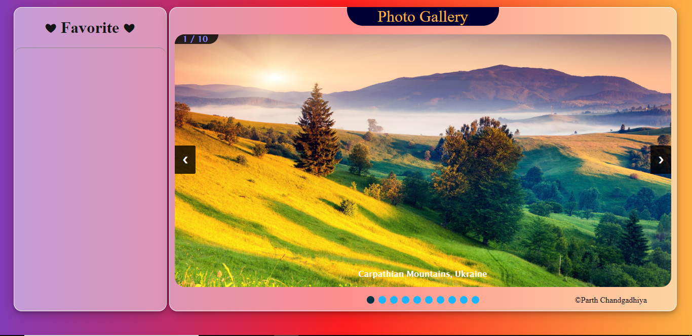
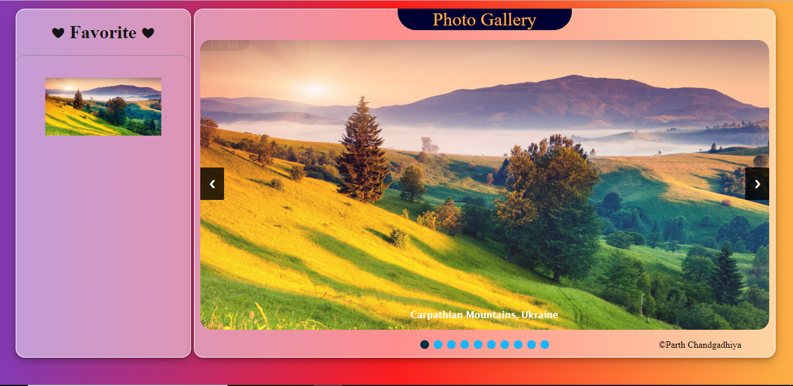
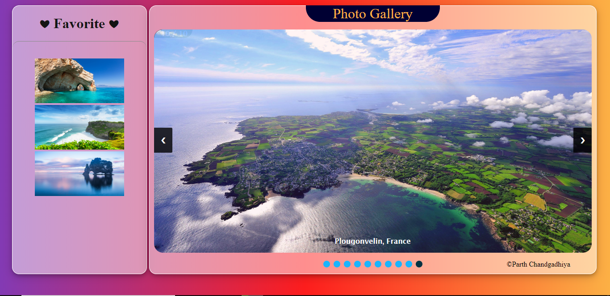
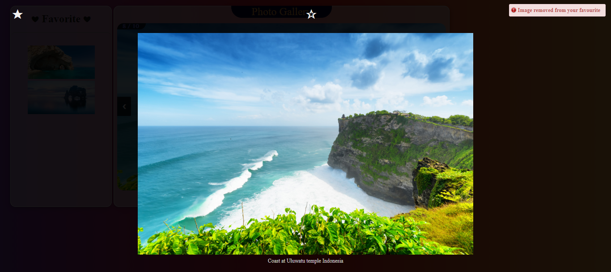

# Photo-gallery
IOS like Javascript photogallery

Photo Gallery displays set of pictures for users to pick and add them as their favorite. Liked images are then pinned on left side of the screen and can be removed from the list of liked using simple buttons.
This project was java-script only.

## Main Screen
  

## Options
  

## Adding image to favourite
  

## Image Added to Favourite list
  

## Mutiple Favourite 
  

## Image removed from favourite
  
